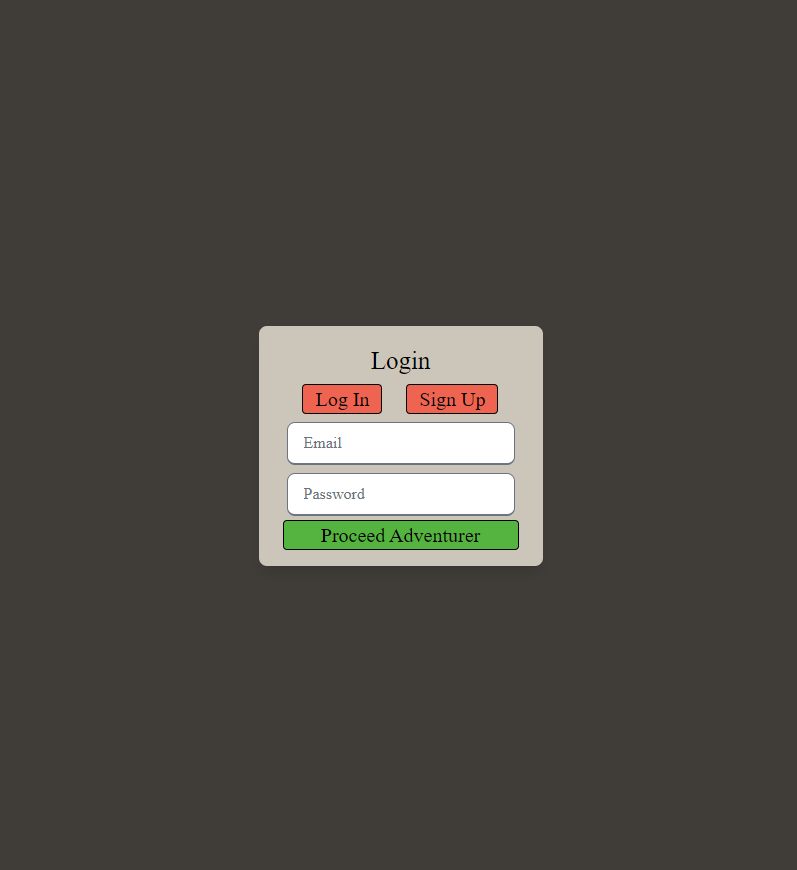

Dungeons and Dragons is a classic game where players can lose themselves in a fantasy world of their choice and be whatever character they wish to be. The character, really, is the focal point of the game. Our application helps players, new and veteran, keep track of that essential focal point of the game.

Scenario:

You have just created a new character. You have the option of keeping it among the physical copies of paper character sheets you have, and run the risk of losing them. Or.. You can store them within Dungeon Chest, an application with the specific purpose of saving all of your Dungeon and Dragons characters and their stats where you can easily access them. 

Purpose:

Dungeon Chest is an application that you can input all of your characters and their stats for easy access whenever you need to.

Screenshot of deployed website: 

repository link: https://github.com/MaddieBurns12/dungeon-chest

created by: Madeline Burns, Farrell Dianni, Liliana Perez, Jayden Tripp